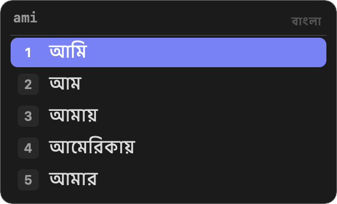
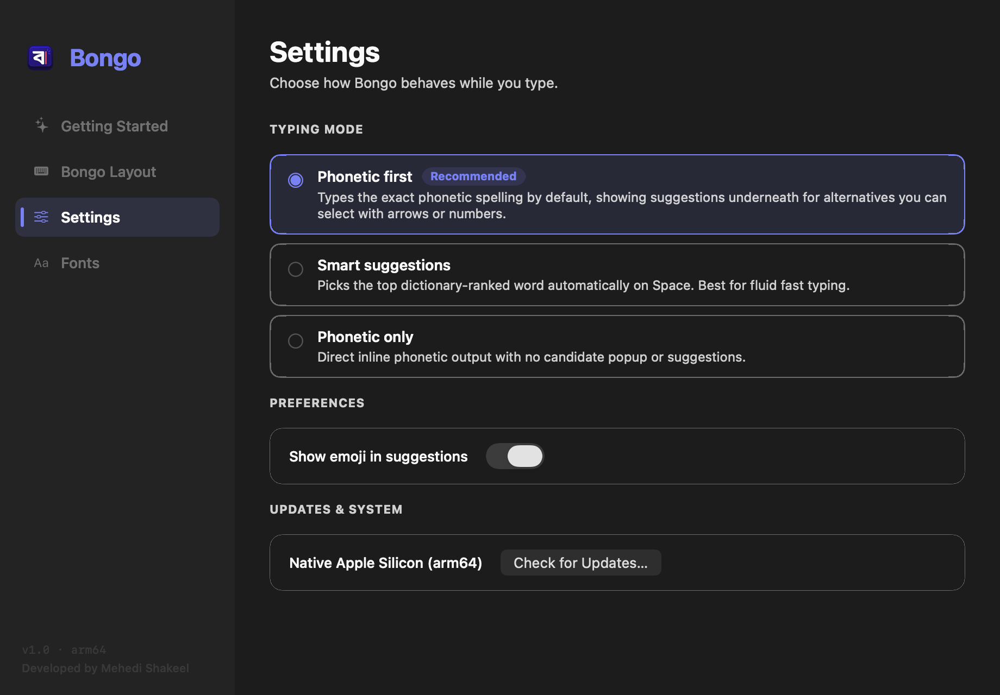

<p align="center">
  
</p>

<h1 align="center">Bongo · বঙ্গ</h1>

<p align="center">
  <strong>Native Bangla Phonetic Keyboard for macOS Apple Silicon</strong>
</p>

<p align="center">
  <a href="https://github.com/mehedishakeel/Bongo/releases/latest"></a>
  <a href="https://github.com/mehedishakeel/Bongo/releases/latest"></a>
  <a href="LICENSE"></a>
  <a href="https://getbongo.app"></a>
</p>

<p align="center">
  <a href="https://github.com/mehedishakeel/Bongo/releases/latest/download/Bongo-1.0-macos-arm64.dmg">
    
  </a>
</p>

---

**Bongo** is a fast, lightweight, and modern Bengali input method built exclusively for Apple Silicon Macs (M1/M2/M3/M4+). It brings familiar phonetic typing directly into all your macOS apps with instant suggestions, a sleek HUD candidate bar, and complete on-device privacy.

**Visit the official website & interactive demo**: [https://getbongo.app](https://getbongo.app)

---

## Quick Installation (3 Steps)

1. **Download**: Get the latest `Bongo-1.0-macos-arm64.dmg` from [Releases](https://github.com/mehedishakeel/Bongo/releases/latest).
2. **Install**: Open the DMG and drag **Bongo.app** into your **Applications** folder.
3. **Activate**:
   - Open **Bongo** from Applications once (it registers the keyboard with macOS).
   - Go to **System Settings → Keyboard → Input Sources → Edit → +**, and select **Bongo** (under Bengali).
   - Switch keyboards anytime with the **Globe (<kbd>fn</kbd> / Globe)** key or <kbd>Control + Space</kbd>!

---

## How to Type

Bongo uses the standard, intuitive **Avro Phonetic** rules you already know. Type Bengali words according to how they sound in English letters:

| English Keystrokes | Bangla Output | Meaning |
|:---|:---|:---|
| `ami` | **আমি** | I / Me |
| `bangla` | **বাংলা** | Bengali |
| `dhonnobad` | **ধন্যবাদ** | Thank you |
| `shonar bangla` | **সোনার বাংলা** | Golden Bengal |
| `kemon achen` | **কেমন আছেন** | How are you? |
| `kkhoma` | **ক্ষমা** | Forgive |
| `gyan` / `jnj` | **জ্ঞান** | Knowledge |

Press <kbd>Space</kbd> to commit the highlighted word, or press number keys <kbd>1</kbd>–<kbd>5</kbd> to pick from the candidate list immediately.

---

## Key Features

- **100% Apple Silicon Native**: Built strictly for `arm64` architecture. No Intel emulation, zero Rosetta lag, negligible memory usage, and near-zero latency.
- **Privacy-First (On-Device)**: Your typing, vocabulary, and preferences never leave your Mac. No network calls, no analytics, and no accessibility keylogging permissions needed.
- **Modern macOS HUD**: Beautiful floating suggestion bar with tactile shortcut keys (`[1]`, `[2]`), arrow navigation, and high-contrast pill styling.
- **3 Typing Modes**: Choose between *Phonetic first* (exact phonetic spelling by default), *Smart suggestions* (dictionary auto-selection), or *Phonetic only* (direct inline output).
- **Custom Fonts**: Choose any Bengali font installed on your Mac (Kohinoor Bangla, Noto Sans Bengali, Ekush, etc.) with real-time size adjustments.
- **Menu Bar Integration**: Switch modes and access layout guides straight from the macOS input menu bar icon.

---

## Screenshots

<p align="center">
  
  <br>
  <em>Tactile Candidate HUD with fast numbered shortcuts</em>
</p>

<p align="center">
  
  <br>
  <em>Modern Settings Window with 3 typing modes & emoji customization</em>
</p>

---

## For Developers

To build Bongo from source on an Apple Silicon Mac:

```sh
# 1. Clone repository
git clone https://github.com/mehedishakeel/Bongo.git
cd Bongo

# 2. Build Apple Silicon DMG
./platforms/macos/scripts/create-dmg.sh

# 3. Run validation tests
python3 -m unittest discover -s tests -v
```

See [docs/BUILDING.md](docs/BUILDING.md) and [docs/ARCHITECTURE.md](docs/ARCHITECTURE.md) for full developer documentation.

---

## Credits & License

Bongo is developed and maintained by **[Mehedi Shakeel](https://github.com/mehedishakeel)**.

- **Foundational Architecture**: Derived from [Lekho](https://github.com/ARahim3/Lekho) by Abdur Rahim.
- **Phonetic Engine**: Powered by [riti](https://github.com/OpenBangla/riti) (OpenBangla contributors).
- **Phonetic Layout Scheme**: Avro Phonetic scheme by OmicronLab (Dr. Mehdi Hasan Khan).

Licensed under the **[Mozilla Public License 2.0 (MPL-2.0)](LICENSE)**.
